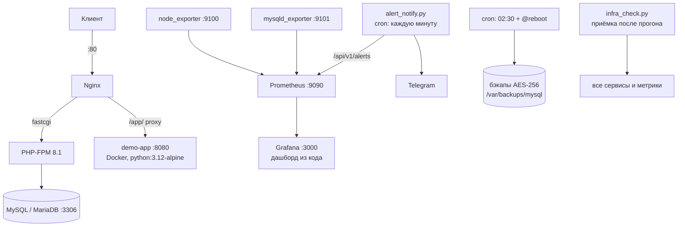

# Архитектура стенда

Все компоненты — на одном хосте (localhost, WSL + systemd), управляются Ansible.
Последний play каждого прогона — приёмка: если стенд нездоров, прогон падает.

## Схема

## Порты

| Порт | Сервис | Доступ |
|---|---|---|
| 80 | Nginx (LEMP + proxy `/app/`) | все |
| 3306 | MySQL / MariaDB | localhost |
| 8080 | demo-app (контейнер) | только localhost |
| 9090 | Prometheus | UFW-разрешён |
| 9100 | node_exporter | UFW-разрешён |
| 9101 | mysqld_exporter | UFW-разрешён |
| 3000 | Grafana | UFW-разрешён |

## Учётки СУБД (least privilege)

| Пользователь | Права |
|---|---|
| `app_user` | только операции данных в `app_db` |
| `exporter` | `PROCESS, REPLICATION CLIENT, SELECT` — мониторинг |
| `backup` | права полного дампа всех баз |
| `root` | только с localhost |

## Потоки

- **Веб:** клиент → Nginx → PHP-FPM (fastcgi) → MySQL; клиент → Nginx `/app/` → контейнер demo-app.
- **Метрики:** exporters → Prometheus (scrape 15s) → Grafana (provisioned datasource + дашборд).
- **Алерты:** правила Prometheus (MySQLDown / InstanceDown / DiskAlmostFull) → `alert_notify.py` раз в минуту → Telegram (FIRING/RESOLVED, дедупликация, ретраи).
- **Бэкапы:** cron 02:30 + @reboot → mysqldump → gzip → openssl AES-256 → ротация 7 дней; при ошибке — rescue-алерт в лог/Telegram.
- **Приёмка:** `infra_check.py` после каждого прогона: сервисы active, HTTP 200, `mysql_up 1`, алерт-правила загружены, demo-app отвечает, бэкап свежее 26 часов.
