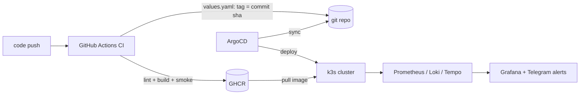
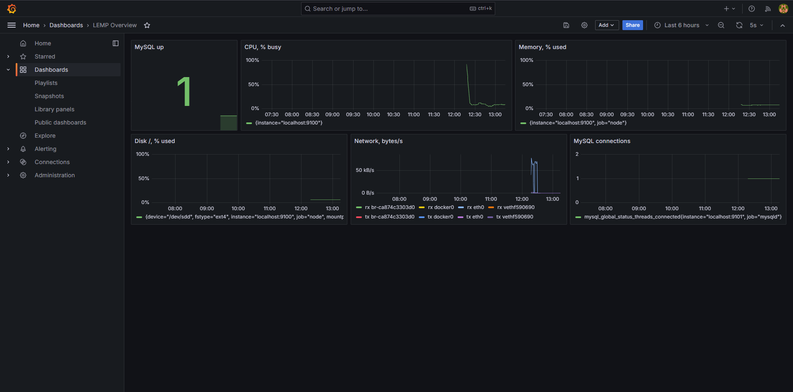
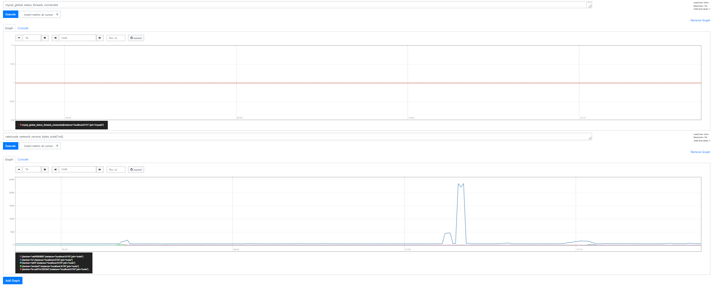
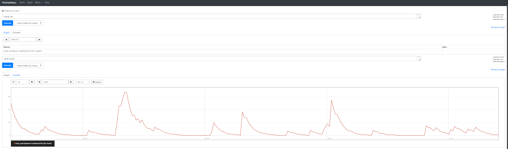
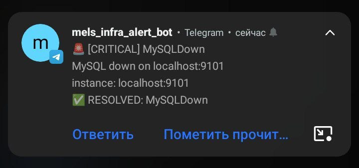

# Home Lab Platform: Ansible → Docker → Kubernetes → GitOps → Observability

Учебно-продакшн инфраструктурный проект: полная цепочка доставки приложения
от коммита до работающего кластера с метриками, логами и трейсами.
Всё крутится на локальном k3s (WSL2) и управляется как код.

## Architecture



## Stack

| Слой | Инструменты |
|---|---|
| Конфиг-менеджмент | Ansible (roles, playbooks, vault), Terraform (remote state в MinIO) |
| Контейнеризация | Docker, python:3.12-alpine, OpenTelemetry SDK |
| Кластер | k3s, Helm (собственный chart demo-app), ingress-nginx |
| GitOps | ArgoCD (auto-sync, self-heal) |
| CI/CD | GitHub Actions: ansible-lint → docker build + smoke → publish в GHCR по commit sha |
| Наблюдаемость | Prometheus, Grafana, Loki + Promtail, Tempo; алерты в Telegram |

## Delivery pipeline

1. Push в main → GitHub Actions: ansible-lint + syntax-check плейбуков.
2. Job build: docker build + smoke test (контейнер стартует, / отдаёт JSON).
3. Job publish: образ уходит в GHCR с тегами `latest` и `<commit sha>`.
4. В values.yaml — новый sha-тег → ArgoCD синхронизирует Helm-релиз.
5. Кластер тянет образ из GHCR по неизменяемому тегу; rolling update страхован readiness-пробами.

## Observability

- **Метрики**: Prometheus + Grafana (дашборд LEMP Overview), алерты в Telegram (MySQLDown / InstanceDown / DiskAlmostFull).
- **Логи**: Promtail → Loki; логи приложения несут trace_id; фильтрация по namespace/pod/container в Explore.
; алерты по ERROR-строкам уходят в Telegram
- **Трейсы**: OpenTelemetry в приложении → Tempo; waterfall по каждому запросу; переход лог → трейс по trace_id.

## Releases

- **v1.0–v1.3** — LEMP-стенд на Ansible: baseline, security-hardening, мониторинг, шифрованные бэкапы, Python-приёмка
- **v1.4** — K8s: Helm chart demo-app, Ingress, GitOps через ArgoCD
- **v1.5** — логи: Loki + Promtail + datasource в Grafana
- **v1.6** — трейсы: Tempo + OpenTelemetry-инструментация приложения
- **v1.7** — образы в GHCR: CI publish + pull кластером из реестра
- **v1.8** — CD-бот: авто-bump тега в values после publish; алерты по логам: Loki → Grafana Alerting → Telegram

## Структура репо

```
infra-ansible/
├── .github/workflows/ci.yml        # CI: lint → build+smoke → publish в GHCR
├── charts/demo-app/                # Helm chart: Deployment/Service/Ingress/ConfigMap
├── roles/, playbooks/, inventory/  # Ansible-часть стенда (LEMP, мониторинг, бэкапы)
├── terraform/                      # контейнерный слой как IaC, remote state в MinIO
├── docs/
│   └── LEMP-ansible-stand.md       # детальный документ Ansible-фазы
└── README.md
```

## Быстрый старт

```bash
# Ansible-стенд (LEMP + мониторинг + бэкапы)
ansible-galaxy collection install -r requirements.yml
ansible-playbook playbooks/site.yml --vault-password-file .vault_pass

# Terraform: контейнерный слой
cd terraform && terraform init && terraform apply -auto-approve

# K8s-слой: k3s + ArgoCD; доставка приложения — цепочкой из Delivery pipeline
```

## Known issues

- Grafana Loki datasource health-check показывает "Unable to connect": Grafana шлёт
  служебный запрос `vector(1)`, который Loki 2.6 (deprecated loki-stack chart) не парсит.
  Запросы логов работают (HTTP 200). Путь миграции: официальный loki chart / Loki 3.x.

## Документация по слоям

- [LEMP-стенд на Ansible: security, бэкапы, приёмка](docs/LEMP-ansible-stand.md)

## License

MIT — используйте и адаптируйте свободно.

## Автор

**MELS** — демонстрация навыков системного администрирования и путь в DevOps.
## Screenshots

| Grafana: дашборд LEMP Overview | Prometheus: load1 / MySQL |
|:---:|:---:|
|  |  |
| *дашборд provisioned из кода* | *пики load1 во время прогонов плейбука* |

| Prometheus: сеть и MySQL-метрики |
|:---:|
|  |
| *трафик хоста во время приёмки и бэкапов* |

<div align="center">
<br>
<em>Боевой алерт: stop mysql → 🚨 CRITICAL MySQLDown → start → ✅ RESOLVED</em>
</div>
